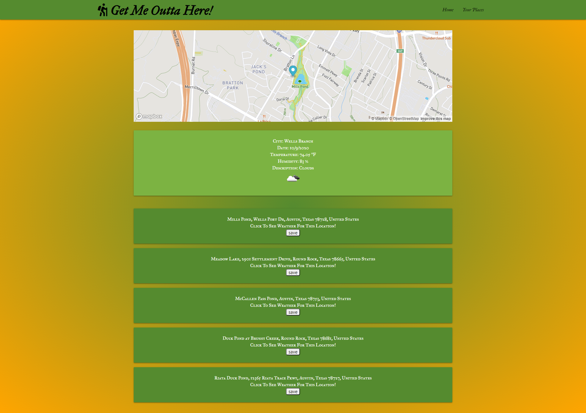

# GetMeOutOfHereApp

## User Story
```
  As an Outdoorsy Person
  I want an app that shows my near places and current weather over there based on my selected type of place
  So that I can get the information exactly what i want
  ```

 ## Technologies used:
* HTML, CSS, Materialize, Java script, JQuery, openweather API , mapbox API

## Features:
* Interactive website.
* User friendly.
* Letting the user, to select type of place they want to go, by providing clear dropdown options.
* Show 5 nearest places according to user interest.
* Map to show 5 nearest places, to give exact information to the user.
* show current weather details in the selected place with icon and Map.
* Option to save interested location
* Responsive Layout


# Challenges:
* Getting information and integrating with different API's
* Using Map

# Sample web page




# Github Page 
https://drop-g.github.io/GetMeOutOfHereApp/


# Github Repository
https://github.com/Drop-G/GetMeOutOfHereApp

# Contact 
satyakavya24@gmail.com , 
elizakennelly@gmail.com, 
tedpetersiv@gmail.com


copyright@2020

